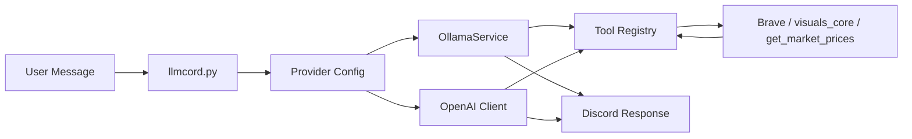

# gpt-discord-bot Project Specification

## Overview
This document outlines the technical specification for the `gpt-discord-bot` project, including architecture diagrams, key APIs/functions, module relationships, and external API definitions. It serves as a reference manual for developers involved in the project.

## High-Level Architecture

## Main Functional Modules

### **bot/**
- `main.py`: Alternate entry point.
  - Description: Delegates to `llmcord.main`. Use `python -m bot.main` or `python llmcord.py` to run the bot.

### **bot/config/**
- `loader.py`: Configuration file loader.
  - Description: Loads `config.yaml` (or path from `CONFIG_PATH`), validates via validator, returns config dict.

- `validator.py`: Validates configuration files.
  - Description: Ensures loaded config has required `providers`, `models`, and valid structure for tasks, permissions, tools.

- `personas/`: Defines different AI roles (e.g. `bao.md`, `stock_market_analyst.md`).
  - Description: Markdown or YAML files loaded by `try_load_persona` for model/task/global persona.

- `tasks/`: Scheduled task definition files (e.g. `email_check.yaml`, `stock_market_check.yaml`).
  - Description: YAML files loaded by `load_scheduled_tasks`; file-based tasks override inline `scheduled_tasks` in config.

### **bot/discord/**
- `errors.py`: Discord-specific error handling.
  - Description: `notify_admin_error` DMs admins; `handle_app_command_error` handles slash-command errors.

### **bot/llm/**
- `ollama_service.py`: Ollama LLM runner with tool-calling.
  - Description: Builds tool registry (Brave or Ollama native), injects skill docs from `bot/llm/tools/skills/*.md`, runs chat with optional tools.

- **tools/**:
  - `registry.py`: Single source of truth for all tools (ToolEntry, build_tool_registry, execute_tool_call).
  - `web_search.py`: Brave Search API and Ollama-native web_search/web_fetch; schemas and formatters.
  - `visuals_core.py`: ASCII/Markdown visualizations (table, chart, heatmap, timeline, flowchart, tree).
  - `yahoo_finance.py`: Yahoo Finance closing prices via yfinance.
  - `skills/`: OpenClaw-format skill docs (e.g. `web_search.md`, `visuals_core.md`) injected into system prompt when tools are enabled.

## Key API / Functions

| Module | API / function | Purpose |
|--------|----------------|---------|
| **llmcord.py** | `get_config(filename)` | Load and validate config (delegates to bot.config.loader). |
| | `format_system_prompt(prompt, accept_usernames)` | Substitute `{date}`, `{time}` and optionally add username hint. |
| | `build_openai_client(provider_cfg)` | Build `AsyncOpenAI` from provider base_url/api_key. |
| | `build_extra_body(provider_cfg, model_params, exclude)` | Merge extra_body and model params. |
| | `run_ollama(provider_cfg, model, model_params, messages)` | Run Ollama model with tools (async, uses executor). |
| | `stream_openai(client, model, messages, **kwargs)` | Stream OpenAI-compat completion; returns list of content chunks. |
| | `run_openai_with_tools(...)` | Non-streaming OpenAI-compat call with tool-call loop; executes tools via `execute_tool_call` and Brave registry. |
| | `run_scheduled_task(task_name, task_config)` | Execute one scheduled task (channel or user DM). |
| | `parse_cron(expr)` | Parse 5-field cron string to APScheduler kwargs. |
| | `setup_scheduled_tasks()` | Load tasks from config + file and register cron jobs. |
| **bot/main.py** | `run_bot(config)` | Async entry; delegates to llmcord.main. |
| | `main()` | Sync entry; asyncio.run(run_bot()). |
| **bot/config/loader.py** | `get_config_path()` | Resolve path (CONFIG_PATH env or default config.yaml). |
| | `get_config(path)` | Load YAML, validate via validator, return config dict. |
| **bot/config/validator.py** | `validate_config(cfg, config_path)` | Validate structure; raise ConfigValidationError on failure. |
| | `ConfigValidationError` | Exception for validation failures. |
| **bot/config/personas.py** | `load_persona(name)` | Load persona by name from personas/ (.md, .txt, .yaml); raise if not found. |
| | `try_load_persona(name)` | Best-effort load; returns None on failure, logs warning. |
| **bot/config/tasks.py** | `load_scheduled_tasks(config)` | Load tasks from bot/config/tasks/*.yaml and merge with config['scheduled_tasks']. |
| **bot/discord/errors.py** | `notify_admin_error(discord_bot, config, error, context)` | DM all admin_ids with error summary. |
| | `handle_app_command_error(interaction, error, discord_bot, config)` | Central slash-command error handler; notifies admins and replies to user. |
| **bot/llm/errors.py** | `parse_error_message(error)` | Short admin-facing error message. |
| | `format_user_friendly_error(error)` | Short user-facing (zh-TW) message. |
| | `error_messages(error)` | Returns (admin_message, user_message). |
| **bot/llm/ollama_service.py** | `OllamaService(host, web_search_provider)` | Client for Ollama; builds tool registry (Brave or Ollama native). |
| | `OllamaService.run(messages, model, enable_tools, think, max_tool_chars)` | Chat with optional tools; injects skill docs; returns content, thinking, tool_results, messages. |
| **bot/llm/tools/registry.py** | `ToolEntry` (dataclass) | schema, fn, formatter. |
| | `build_tool_registry(ollama_client, web_search_provider)` | Full registry; wires web_search/web_fetch to Brave or Ollama. |
| | `build_brave_registry()` | Registry with Brave web search only (for OpenAI/OpenRouter). |
| | `get_openai_tools(tool_names)` | Return OpenAI-format tool schemas for given names. |
| | `execute_tool_call(name, args, registry, max_chars)` | Run tool by name, return formatted string. |
| | `format_tool_result(entry, result, args)` | Format via entry.formatter or str(). |
| **bot/llm/tools/web_search.py** | `brave_web_search(query)` | Call Brave Search API; rate-limited (1 req/s). |
| | `format_brave_results(result, user_search)` | Format Brave JSON for model. |
| | `format_web_search_results(results, user_search)` | Format Ollama or Brave response. |
| | `WEB_SEARCH_SCHEMA`, `WEB_FETCH_SCHEMA` | OpenAI-format tool schemas. |
| **bot/llm/tools/visuals_core.py** | `generate_visualization(viz_type, title, **kwargs)` | Dispatch to table/chart/heatmap/timeline/flowchart/tree. |
| | `VISUALS_CORE_SCHEMA` | OpenAI-format tool schema. |
| **bot/llm/tools/yahoo_finance.py** | `get_market_prices(tickers, days)` | Fetch closing prices from Yahoo Finance; returns formatted string. |
| | `YAHOO_FINANCE_SCHEMA` | OpenAI-format tool schema. |

## Other Files

- `llmcord.py`: Main entry point (Discord bot, message handling, scheduling).
- `docker-compose.yaml`, `Dockerfile`: Docker build and run.
- `.env`: Environment variables (e.g. `BRAVE_API_KEY`, `OLLAMA_API_KEY`, `CONFIG_PATH`).
- `README.md`, `LICENSE.md`: Project documentation and license.
- `.github/`: GitHub workflows and Copilot prompts.
- `TODOLIST.md`: Project task list and roadmap.
- `SKILLS.md`: Skill index (human and AI readable); see also `bot/llm/tools/skills/`.
- Test files (e.g. `test_brave_api_web_search.py`, `test_config_validator.py`, `test_ollama.py`): Unit tests for core components.
- `report.md`: Project status and progress reports.
- `requirements.txt`: Python dependencies.

## API Definitions (External Services)

- **Brave Search API**: `GET https://api.search.brave.com/res/v1/web/search` with query `q`, `count`; header `X-Subscription-Token` (or `Accept`, `Accept-Encoding`). Returns JSON with `web.results[]` (title, url, description). Used when `web_search_provider: brave`; requires `BRAVE_API_KEY` in `.env`. Free tier: ~1 req/s (bot enforces via lock + sleep).

- **Ollama**: Chat and tool endpoints on provider `base_url` (e.g. `http://localhost:11434`). Supports `chat` with `tools` (OpenAI-format schemas), optional `web_search`/`web_fetch` when using Ollama native. Optional `OLLAMA_API_KEY` in `.env` for remote instances.

- **OpenAI-compatible APIs**: `client.chat.completions.create(model, messages, tools?, stream?, extra_headers?, extra_query?, extra_body?)`. Tool calls return `tool_calls`; bot executes tools locally and appends `role: "tool"` messages. Used for OpenRouter, OpenAI, xAI, Groq, etc.

- **Yahoo Finance**: Via `yfinance` library (no REST API key). `yf.Ticker(symbol).history(period=f"{days}d")` for closing prices; used by `get_market_prices`.

## Testing

- `test_brave_api_web_search.py`: Unit test for Brave API web search integration.
- `test_config_validator.py`: Configuration validation with valid and invalid inputs.
- `test_ollama.py`: Ollama service interaction.
